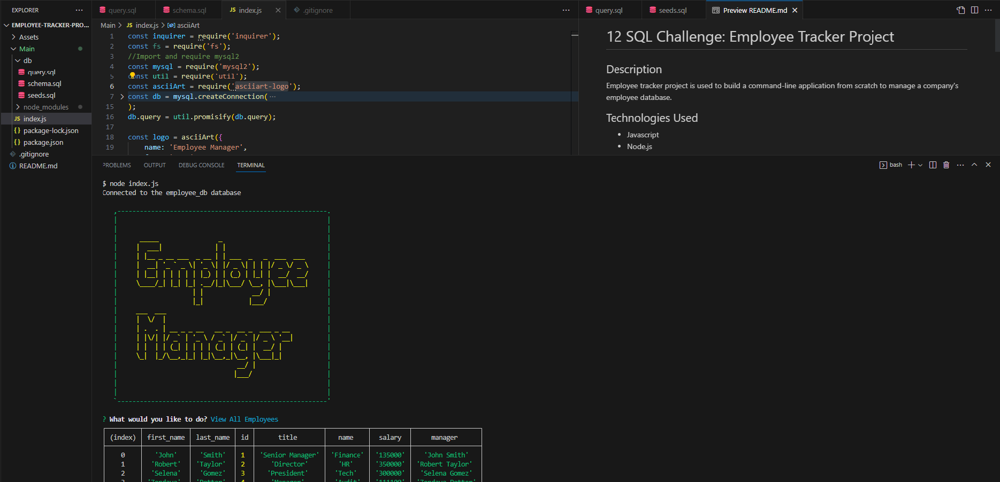

# Employee tracker

## Description
Employee tracker project is used to build a command-line application from scratch to manage a company's employee database.

## Technologies Used

- Javascript
- Node.js
- npm
- SQL

## Installation

What are the steps required to install your project?
- Provided step by step description on how to get the development of environment running. 
- Installed npm using npm init to initiate the npm.
- After that installed npm using npm i inquirer@8.2.4 to get that version and also get the package-lock.json and node_modules folder.
- Added the mysql password using mysql -u root -p command in command line then execute the schema.sql, seeds.sql, query.sql using source command. For example source schema.sql.
- Also installed asciiart-logo using npm i asciiart-logo.

## Usage

Screenshot of logo.svg file

## Credits

If you followed tutorials, include links to those here as well: https://www.w3schools.com/

## Links

-URL link for the deployed Github application: https://rudrijoshi.github.io/Employee_tracker/

-URL link for the Github repository: https://github.com/rudrijoshi/Employee_tracker/

-URL link for the screencastify: https://watch.screencastify.com/v/I3r4GAQhd0ofDEBpF9Ya
